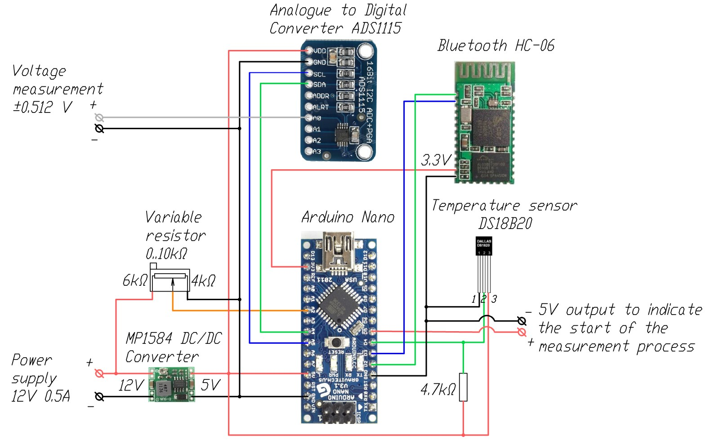

# Bluetooth Voltage Sensor
Voltage and temperature monitoring system with readings transmitted via Bluetooth

Designed for measuring voltage with high accuracy and transmitting results wirelessly to a monitoring system (PC, Mobile phone or other controller equipped with a Bluetooth receiver).

To increase the measurement accuracy (make additional corrections), in addition to voltage, the exact temperature in the measurement zone is also transmitted. The temperature sensor readings can also be used to protect against overheating of the equipment on which the system is installed.

The system is powered from a 12V DC network through a step-down converter. The supply voltage can affect the accuracy of the measurement, so it is also monitored and transmitted with other data. The supply voltage reference value can be further adjusted during commissioning using a variable resistor.

Additional data transmission (temperature and power supply voltage) can be disabled to reduce the amount of data transmitted (if this data is not required or the voltage measurement frequency needs to be significantly increased)

## Operating logic
The measurement is carried out using a high-precision ADC converter ADS1115 connected to the Arduino Nano controller via the I2C protocol. 

The ADC has several measurement modes, which differ in accuracy and measurement duration. By default, the firmware is configured to measure with a multiplier of “8x”, which corresponds to the measurement range +/-0.512V and the measurement limit per 1 bit = 0.25mV.

> [!WARNING]
> For the x8 multiplier set, the measured voltage should not go beyond +/-0.8V (0.512+60%). If exceeded, the ADC will fail. To measure higher voltages, you must first change the multiplier value (which will correspondingly reduce the measurement accuracy) in the firmware before turning on the system

After power is applied to the system, a pause of 1 second is maintained (`ADSPause` variable, default 1000ms) necessary for the measured equipment to turn on correctly.

After this, every 0.3s (`ADSDelay` variable, default 300ms) the voltage at the input of the ADS1115 ADC is measured. To reduce noise, 3 voltage values are measured (parameter `ADSCount`, default 3) after which the average is calculated and used as the result of the current measurement.

To control the supply voltage, Arduino’s own analog output is used, which measures the voltage at the analog input every 1s (`PowerVolageDelay` parameter, default 1000ms). 

To reduce the 12V supply voltage to the measurement range of 0..5V, a variable resistor is used, connected to ground as a step-down resistor. By default, it is set to the 6kΩ+4kΩ position, which corresponds to a reduction factor of 2.5 (to bring the results at the analog input back to the reference 12V supply voltage, use the `PowerVolageRatio` parameter, default 2.5)

To monitor the temperature, a DS18B20 sensor is used, measurements are taken every 1s (`TemperatureDelay` parameter, default 1000ms) For the default resolution of 9 bits, each measurement takes 94ms. When increasing accuracy, the measurement frequency cannot be higher than 1 measurement per 0.75 s.

## Output format
When a request for current measurements is received via the serial interface, a string with the current measurements is sent

When a `n` request is received (request for all parameters), the following string is sent in response:

`U:12.03 T:22.3 Q:0.33325`
* `U:12.03`	– is the supply voltage 12.03 V
* `T:22.3` 	– temperature 22.3°C
* `Q:0.33325`– measured voltage 0.33325 V

When a `q` request is received (a voltage-only request), the following string is sent in response:

`Q:0.33325`	– measured voltage 0.33325 V

Immediately after receiving the command to start measurement, the controller signals the start of the measurement process by issuing a 5V logical signal at input D5. This signal can be used to connect an alarm LED or connected to another automation system

## Main characteristics
* Main controller			– Arduino Nano 
* Processor 				– 16 MGh, ATmega328P
* Controller memory			– 32 KB Flash + 2 kB SRAM + 1kB EEPROM
* Controller analog input		 – 10 bit (1024 levels)
* Controller analog input resolution	– 0.00448V 
* Voltage sensor			– ADC converter ADS1115
* Voltage sensor resolution		– 16bits
* Sample rate 				– 8 to 860 samples/sec
* Possible ADC multipliers and resolution	
    - x2/3				– input range ±6.144V, 
    - x1				– input range ±4.096V, 1bit=2mV
    - x2				– input range ±2.048V, 1bit=1mV
    - x4				– input range ±1.024V, 1bit=0.5mV
    - x8 				– input range ±0.512V, 1bit=0.25mV (by default)
    - x16 				– input range ±0.256V, 1bit=0.125mV
* Temperature sensor			– DS18B20
* Temperature resolution			– 9..12 bit
* Measurement  time			– 94..750ms (9..12bit) By default - 94ms
* Measurement range			– -10..+85°C
* Measurement accuracy		– ±0,5°C
* Power supply DC/DC converter	– MP1584 
* Input power supply voltage		– 4.5-28V (Adjustable)
* Nominal input power			– 12V 0.5A
* Operating temperature: 		– -10..+85 °C)
* Dimensions				– 50x25x20mm (components assembled in case)
* Weight					– 50 g (with plastic case)

## Components

* Arduino Nano    				– 1pcs.
* !(Module ADC ADS1115)[https://amzn.to/47lVBxj]			– 1pcs.
* Temperature sensor DS18B20	– 1pcs.
* Bluetooth module HC-06		- 1pcs.
* DC-DC Converter MP1584		- 1pcs.

## Wiring diagram

 
## Further system improvements
- [ ] Adding measurement channels (up to 4 in total)
- [ ] Delivery of results using a timer or a logical signal (from a button or other automation system)
- [ ] Adding an LCD screen with real-time display of measurement results
- [ ] Maintaining a log of parameters with time markers
- [ ] Adding a trigger for exceeding the reading with additional actions (turning on/off the relay, issuing logical signals, sound alarm etc.)
- [ ] Adding an independent power supply
- [ ] Web interface and data transfer to the cloud
